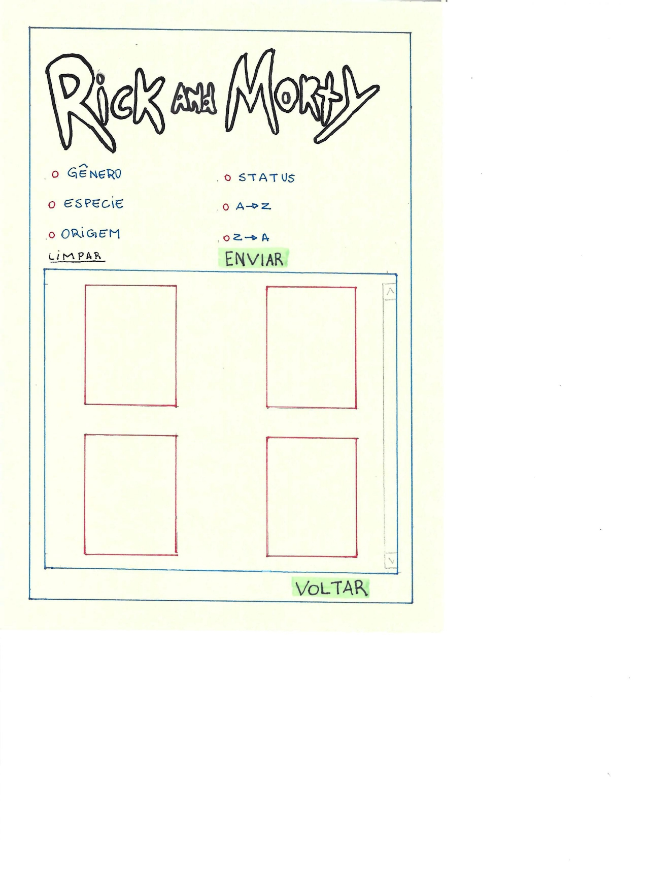
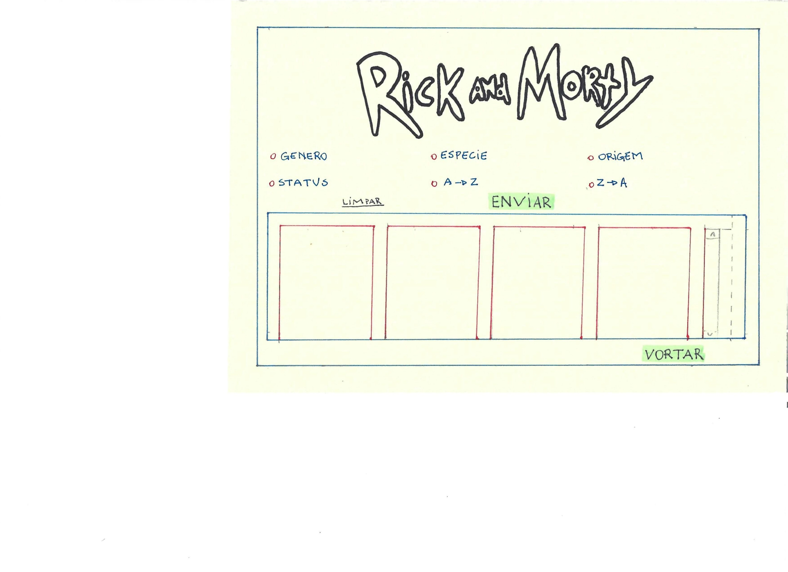

# Rick and Morty 

## Índice

* 1. Sobre o pojeto
* 2. Fluxo de usuário
* 3. Informações de entrada e saída:
* 4. Visão de produto (macro)
* 5. História de usuário:
* 6. Paleta de cores:
* 7. Protótipo de baixa fidelidade 2º interface (celular)
* 8. Protótipo de baixa fidelidade 2º interface (desktop)
* 9. Protótipo de alta fidelidade 1º e 2º interface (celular)
* 10. Lista de problemas detectados nos testes de usabilidade

## 1-Sobre o projeto

[link do projeto](https://oxibarbara.github.io/SAP008-data-lovers/)

## 2-Fluxo de usuário

## 3-Informações de entrada e saída:
 *Nome:
 *Estado de vida:
 *Espécies: 
 *Gênero: 
 *Lugar de origem:
 *Lugar onde vive:

## 4-Visão de produto (macro)
 *Página Web
 *Visualizar o conjunto de dados
 *Filtrar dados
 *Ordenar dados
 *Calculo agregado (médias, valores máximos e mínimos, etc.)

## 5-Histórias de usuários:
  * 1-"Eu sou um grande fã da série
  e "Eu sou um grande fã da série e gostaria de poder visualizar uma com as informações dos personagens que eu desejo."
 Assim se originou a ideia de criar filtros para as categorias das informações, permitindo que o usuário escolhesse a informação que deseja obter.

 * 2-"Eu sou um jogador de RPG iterpretativo e gostaria de uma lista de personagens que eu pudesse visualizar principalmente as imagens e informações como, genero, nome, e afins para poder fazer a escolha de quem vou interpretar."
 Tivemos a ideia de fazer cards com as imagens e informações printadas nele de forma clara e direta, surgiu também a idéia de organizar por ordem crescente e decrescente as informações.gostaria de poder visualizar uma com as informações dos personagens que eu desejo."
 Assim se originou a ideia de criar filtros para as categorias das informações, permitindo que o usuário escolhesse a informação que deseja obter.

 * 3-"Eu sou um jogador de RPG iterpretativo e gostaria de uma lista de personagens que eu pudesse visualizar principalmente as imagens e informações como, genero, nome, e afins para poder fazer a escolha de quem vou interpretar."
 Tivemos a ideia de fazer cards com as imagens e informações printadas nele de forma clara e direta, surgiu também a idéia de organizar por ordem crescente e decrescente as informações.

## 6-Paleta de cores:

## 7-Protótipo de baixa fidelidade 2º interface (celular)

## 8-Protótipo de baixa fidelidade 2º interface (desktop)

## 9-Protótipo de alta fidelidade 1º e 2º interface (celular)

## 10-Lista de problemas detectados nos testes de usabilidade

* PROBLEMA 1.
O botão que leva para a parte de personagens originalmente se assemelhava demais a uma caixa de texto, nós então adicionamos bordas e uma letra diferente e chamativa junto de uma imagem adequada para a proposta.

* PROBLEMA 2.
Inicialmente eram exibidos em torno de quatro a cinco cards na tela, porém o usuário relatou que a visualização ficava diicil, decidimos então diminuir a quantidade e adequar ela para a proporção de tela utilizada pelo usuário.

* PROBLEMA 3.
O usuário relatou que o fundo possuia uma cor muito contrastante com o restante dos elementos, decidimos então utilizar uma cor mais pastel e clara para facilitar a visualização de textos e elementos contidos na página.

